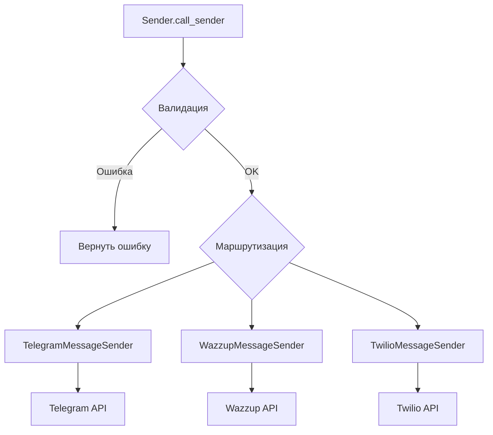

# Multi-Channel Messenger Sender

**Пример лежит в папке** - `helper\src\abc_expl`

Этот проект представляет собой систему для отправки сообщений через различные мессенджеры (Telegram, Twilio/WhatsApp, Wazzup) с использованием паттерна **Абстрактных Базовых Классов (ABC)**.

## 🚀 Зачем здесь абстракция?

В разработке систем коммуникации часто возникает проблема: у каждого API свой синтаксис, свои библиотеки и свои форматы ответа. Если реализовывать вызовы каждого API прямо в бизнес-логике, код превращается в «спагетти» из условий `if/else`, которые крайне сложно поддерживать.

**Абстракция позволяет:**
1.  **Унифицировать интерфейс:** Главный класс `Sender` не знает, как именно работает Twilio или Telegram. Он взаимодействует со всеми отправителями через единый контракт метода `.send()`.
2.  **Легко расширять систему:** Чтобы добавить поддержку нового мессенджера (например, VK или Viber), достаточно создать новый класс, наследуемый от `MessageSender`, не меняя при этом основную логику маршрутизации.
3.  **Изолировать логику:** Бизнес-логика (маршрутизация и условия отправки) строго отделена от низкоуровневой логики взаимодействия с внешними API.

## 🏗 Ключевые компоненты

### 1. `interface_sender.py` — Контракт (Интерфейс)
Здесь определены «правила игры» через `abc.ABC`. Это гарантия того, что любой новый класс-отправитель будет совместим с нашей системой:

```python
class MessageSender(ABC):
    @abstractmethod
    def send(self, message: MessageModel) -> tuple[Optional[str], str]:
        """Все наследники ОБЯЗАНЫ реализовать этот метод."""
        pass
```
### 2. `main.py` — Оркестратор

Класс Sender берет на себя роль «умного маршрутизатора». Он содержит логику fallback-системы:

**Пытается отправить в Telegram.**
- Если Telegram недоступен — проверяет Wazzup.
- Если настроен WhatsApp — использует Twilio.
- Благодаря абстракции код в main.py выглядит чисто и лаконично:


# Нам не нужно знать детали реализации, просто вызываем интерфейс

```python
status = TelegramMessageSender().send(self._message)[1]
```
🛠 Как добавить новый канал отправки? Если вам нужно добавить, например, Email

- Создайте сервис EmailSendMessageService (с логикой SMTP или API).
- Добавьте класс-обертку в interface_sender.py:

```python
class EmailMessageSender(MessageSender):
    def send(self, message: MessageModel):
        return EmailSendMessageService(message).work()
```

📊 Диаграмма потоков



- **Единый API:** вся маршрутизация и логика переключения между сервисами (резервный вариант) сосредоточены в одном месте.

- **Чистота:** бизнес-логика полностью отделена от технической реализации отправки.